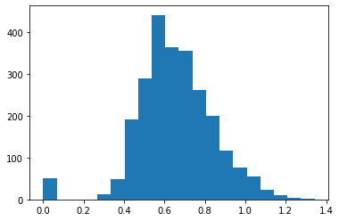
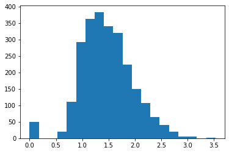

```python
import os
import warnings
warnings.filterwarnings('ignore')
```


```python
from textclustering import utilities as ut
from textclustering import tfidfModule as tfm

#change operating folder      
os.chdir("/Users/arnabborah/Documents/repositories/textclusteringDBSCAN/scripts/")
#read the .csv data file using the dataProcessor class
rp = tfm.dataProcessor("../datasets/DataAnalyst.csv")
```

                                      Job Description  Company Name
    Industry                                                       
    -1                                            353           352
    IT Services                                   325           325
    Staffing & Outsourcing                        323           323
    Health Care Services & Hospitals              151           151
    Consulting                                    111           111
    ...                                           ...           ...
    Chemical Manufacturing                          1             1
    Pet & Pet Supplies Stores                       1             1
    Consumer Product Rental                         1             1
    Metals Brokers                                  1             1
    News Outlet                                     1             1
    
    [89 rows x 2 columns]


```python
#create a flingTFIDF object around the pre-processed daa
ftf = tfm.flingTFIDF(rp.dataInitialSmall,'Job Description')

# tokenization, customizable
ftf.smartTokenizeColumn()

# get Term Frequency of each document, and store add it as an object, in a new column
ftf.getTF()

# compute Inverse Document Frequencies across the entire vocabulary
ftf.computeIDFmatrix()

# get TFIDF, and store it as a new column in data, tf-idf
ftf.getTFIDF()

# compute sum of all tf-idf values and add it as a new column
ftf.createDistanceMetadata()
```

    [ ================================================== ] 100.00%
    Adding term frequency column based on stopsRemoved
    [ ================================================== ] 100.00%
    Computing list of words for IDF...
    
    Created list of terms for IDF matrix with 27075  terms.
    
    Computing global IDF matrix...
    
    [ ================================================== ] 100.00%
    Computing and adding TF-IDF column based on stopsRemoved
    [ ================================================== ] 100.00%


```python
os.chdir("/Users/arnabborah/Documents/repositories/textclusteringDBSCAN/scripts/")
ftf.data.to_pickle('../processFiles/data_tfidf_processed.pkl')
os.chdir("/Users/arnabborah/Documents/repositories/textclusteringDBSCAN/")
```


```python
# load dataset with tf-idf vectors and load pretrained GloVe word vectors
from textclustering import flingPretrained as pre
import pandas as pd

dataProcessed = pd.read_pickle('processFiles/data_tfidf_processed.pkl')
fdb = pre.flingPretrained(dataProcessed)
fdb.loadPretrainedWordVectors('glove')

# adding glove vectors for every document
fdb.addDocumentGloveVector()
```

    
    DBSCAN initialized!
    
    Loading Glove Model
    
    400000  words loaded!
    
    GloVe Vectors Loaded!
    


```python
# use DBSCAN clustering on the glove vectors loaded in the previos
from textclustering import flingDBSCAN as fdbscan

fdbscan1 = fdbscan.flingDBSCAN(fdb.data,None,25,'glove')
fdbscan1.dbscanCompute()
fdbscan1.addClusterLabel('glove-clusterID')
fdbscan1.printClusterInfo()
```

    
    flingDBSCAN initialized!
    
    computing best distance
    [ ================================================== ] 100.00%


    

    


    
    Best epsilon computed on GLOVE = 0.6544420699360174 
    
    
    initiating DBSCAN Clustering with glove vectors
    
    [                                                    ] 0.04%
     ----  cluster_1_ assigned to 565 points! ----
    [                                                    ] 0.09%
     ----  cluster_2_ assigned to 855 points! ----
    [                                                    ] 0.18%
     ----  cluster_3_ assigned to 58 points! ----
    [                                                    ] 0.31%
     ----  cluster_4_ assigned to 119 points! ----
    [                                                    ] 0.53%
     ----  cluster_5_ assigned to 109 points! ----
    [                                                    ] 1.07%
     ----  cluster_6_ assigned to 53 points! ----
    [                                                    ] 1.91%
     ----  cluster_7_ assigned to 37 points! ----
    [ =                                                  ] 2.26%
     ----  cluster_8_ assigned to 55 points! ----
    [ ===                                                ] 6.79%
     ----  cluster_9_ assigned to 35 points! ----
    [ =======                                            ] 15.85%
     ----  cluster_10_ assigned to 32 points! ----
    [ ====================                               ] 41.59%
     ----  cluster_11_ assigned to 27 points! ----
    [ ================================================== ] 100.00%
     11 clusters formed!
    Cluster characteristics:
     -- vectors: glove
     -- minPts: 25
     -- EstimatedBestDistance 0.6544420699360174
     -- 11 clusters formed!
     -- 1945 points assigned to clusters!
     -- 308 noise points!
    
     -- 13.670661340434975 % noise!
    


```python
# converting tf-idf into vectors
fdb.tfidf2vec('tf-only')
fdb.tfidf2vec('tf-idf')

# clustering documents based on 
fdbscan2 = fdbscan.flingDBSCAN(fdb.data,None,25,'tfidf')
fdbscan2.dbscanCompute()
fdbscan2.addClusterLabel('tfidf-clusterID')
fdbscan2.printClusterInfo() 
```

    
    flingDBSCAN initialized!
    
    computing best distance
    [ ================================================== ] 100.00%


    

    


    
    Best epsilon computed on GLOVE-TFIDF = 1.4628292329952732 
    
    
    initiating DBSCAN Clustering with tfidf vectors
    
    [                                                    ] 0.04%
     ----  cluster_1_ assigned to 810 points! ----
    [                                                    ] 0.09%
     ----  cluster_2_ assigned to 695 points! ----
    [                                                    ] 0.31%
     ----  cluster_3_ assigned to 61 points! ----
    [                                                    ] 0.93%
     ----  cluster_4_ assigned to 347 points! ----
    [ =                                                  ] 3.86%
     ----  cluster_5_ assigned to 26 points! ----
    [ =============                                      ] 26.14%
     ----  cluster_6_ assigned to 44 points! ----
    [ ================                                   ] 32.45%
     ----  cluster_7_ assigned to 27 points! ----
    [ ================================================== ] 100.00%
     7 clusters formed!
    Cluster characteristics:
     -- vectors: tfidf
     -- minPts: 25
     -- EstimatedBestDistance 1.4628292329952732
     -- 7 clusters formed!
     -- 1995 points assigned to clusters!
     -- 258 noise points!
    
     -- 11.451398135818907 % noise!
    


```python
fdb.data
```


<div>
<style scoped>
    .dataframe tbody tr th:only-of-type {
        vertical-align: middle;
    }

    .dataframe tbody tr th {
        vertical-align: top;
    }

    .dataframe thead th {
        text-align: right;
    }
</style>
<table border="1" class="dataframe">
  <thead>
    <tr style="text-align: right;">
      <th></th>
      <th>Job Description</th>
      <th>Company Name</th>
      <th>Industry</th>
      <th>stopsRemoved</th>
      <th>tfMatrix</th>
      <th>sumTFIDF</th>
      <th>glove-vector</th>
      <th>glove-clusterID</th>
      <th>tfidf2vec-tf</th>
      <th>tfidf2vec-tfidf</th>
      <th>tfidf-clusterID</th>
    </tr>
  </thead>
  <tbody>
    <tr>
      <th>0</th>
      <td>Are you eager to roll up your sleeves and harn...</td>
      <td>Vera Institute of Justice\n3.2</td>
      <td>Social Assistance</td>
      <td>eager roll sleeves harness data drive policy c...</td>
      <td>word  tf     tf-idf
0          data...</td>
      <td>811.569328</td>
      <td>[0.20507256798029552, 0.05984949950738914, 0.0...</td>
      <td>cluster_0_</td>
      <td>[0.2986073091133004, 0.05040200935960588, 0.09...</td>
      <td>[0.26263354824176166, -0.023444644206149418, -...</td>
      <td>cluster_0_</td>
    </tr>
    <tr>
      <th>1</th>
      <td>Overview\n\nProvides analytical and technical ...</td>
      <td>Visiting Nurse Service of New York\n3.8</td>
      <td>Health Care Services &amp; Hospitals</td>
      <td>overview provides analytical technical support...</td>
      <td>word  tf    tf-idf
0           dat...</td>
      <td>415.287583</td>
      <td>[0.23643422682926837, -0.055056957317073156, 0...</td>
      <td>cluster_1_</td>
      <td>[0.4055475764227641, -0.07285501829268287, 0.1...</td>
      <td>[0.35240058786555273, -0.1412004425681622, 0.0...</td>
      <td>cluster_1_</td>
    </tr>
    <tr>
      <th>2</th>
      <td>We’re looking for a Senior Data Analyst who ...</td>
      <td>Squarespace\n3.4</td>
      <td>Internet</td>
      <td>we’re looking senior data analyst love mento...</td>
      <td>word  tf    tf-idf
0          data ...</td>
      <td>439.815932</td>
      <td>[0.155861351576923, 0.11735425461538473, -0.05...</td>
      <td>cluster_2_</td>
      <td>[0.283220747730769, 0.14354892653846157, 0.044...</td>
      <td>[0.2563749918506738, 0.17575736117618113, -0.0...</td>
      <td>cluster_2_</td>
    </tr>
    <tr>
      <th>3</th>
      <td>Requisition NumberRR-0001939\nRemote:Yes\nWe c...</td>
      <td>Celerity\n4.1</td>
      <td>IT Services</td>
      <td>requisition numberrr remoteyes collaborate cre...</td>
      <td>word  tf     tf-idf
0          •  ...</td>
      <td>569.217931</td>
      <td>[0.2306739880813952, 0.09347254534883724, -0.0...</td>
      <td>cluster_2_</td>
      <td>[0.29634610203488354, 0.10983982558139535, 0.0...</td>
      <td>[0.2966705423736133, 0.028126685382837024, -0....</td>
      <td>cluster_2_</td>
    </tr>
    <tr>
      <th>4</th>
      <td>ABOUT FANDUEL GROUP\n\nFanDuel Group is a worl...</td>
      <td>FanDuel\n3.9</td>
      <td>Sports &amp; Recreation</td>
      <td>fanduel group fanduel group worldclass team br...</td>
      <td>word  tf     tf-idf
0       fanduel...</td>
      <td>420.106719</td>
      <td>[0.12914707201834857, 0.11582829587155963, 0.0...</td>
      <td>cluster_3_</td>
      <td>[0.17368260871559627, 0.10919291513761473, 0.0...</td>
      <td>[0.021771101166884813, 0.16355587986765768, -0...</td>
      <td>None</td>
    </tr>
    <tr>
      <th>...</th>
      <td>...</td>
      <td>...</td>
      <td>...</td>
      <td>...</td>
      <td>...</td>
      <td>...</td>
      <td>...</td>
      <td>...</td>
      <td>...</td>
      <td>...</td>
      <td>...</td>
    </tr>
    <tr>
      <th>2248</th>
      <td>Maintains systems to protect data from unautho...</td>
      <td>Avacend, Inc.\n2.5</td>
      <td>Staffing &amp; Outsourcing</td>
      <td>maintains systems protect data unauthorized us...</td>
      <td>word  tf    tf-idf
0            ...</td>
      <td>43.940807</td>
      <td>[0.2738081315789473, -0.001255321052631562, 0....</td>
      <td>None</td>
      <td>[0.2949110263157894, 0.029555310526315794, 0.0...</td>
      <td>[0.23112386279259817, -0.08318866123802247, -0...</td>
      <td>cluster_4_</td>
    </tr>
    <tr>
      <th>2249</th>
      <td>Position:\nSenior Data Analyst (Corporate Audi...</td>
      <td>Arrow Electronics\n2.9</td>
      <td>Wholesale</td>
      <td>position senior data analyst corporate audit j...</td>
      <td>word  tf     tf-idf
0      ...</td>
      <td>439.042957</td>
      <td>[0.2200468355481728, 0.10710706677740867, 0.04...</td>
      <td>cluster_1_</td>
      <td>[0.3396034966777404, 0.09931764750830561, 0.09...</td>
      <td>[0.3077493047461843, 0.06387599003189207, 0.06...</td>
      <td>cluster_1_</td>
    </tr>
    <tr>
      <th>2250</th>
      <td>Title: Technical Business Analyst (SQL, Data a...</td>
      <td>Spiceorb</td>
      <td>-1</td>
      <td>title technical business analyst sql data anal...</td>
      <td>word  tf    tf-idf
0        busin...</td>
      <td>205.978695</td>
      <td>[0.36188271052631577, 0.05400915065789475, 0.0...</td>
      <td>cluster_2_</td>
      <td>[0.5060029144736842, 0.04490494473684211, 0.11...</td>
      <td>[0.45506833532863533, 5.3025424212786644e-05, ...</td>
      <td>cluster_2_</td>
    </tr>
    <tr>
      <th>2251</th>
      <td>Summary\n\nResponsible for working cross-funct...</td>
      <td>Contingent Network Services\n3.1</td>
      <td>Enterprise Software &amp; Network Solutions</td>
      <td>summary responsible working crossfunctionally ...</td>
      <td>word  tf    tf-idf
0            ...</td>
      <td>364.177527</td>
      <td>[0.25247974618181807, 0.07676844581818185, -0....</td>
      <td>cluster_2_</td>
      <td>[0.34654995709090924, 0.07137524545454547, 0.0...</td>
      <td>[0.27937433353352015, 0.08437047685035409, -0....</td>
      <td>cluster_1_</td>
    </tr>
    <tr>
      <th>2252</th>
      <td>You.\n\nYou bring your body, mind, heart and s...</td>
      <td>SCL Health\n3.4</td>
      <td>Health Care Services &amp; Hospitals</td>
      <td>bring body mind heart spirit work senior quali...</td>
      <td>word  tf    tf-idf
0          data ...</td>
      <td>366.509859</td>
      <td>[0.23890638028806577, 0.1815799016460906, -0.0...</td>
      <td>cluster_2_</td>
      <td>[0.3220337218518514, 0.22893831193415645, 0.07...</td>
      <td>[0.2850343471866271, 0.2451438898926933, -0.08...</td>
      <td>cluster_2_</td>
    </tr>
  </tbody>
</table>
<p>2253 rows × 11 columns</p>
</div>


```python

```
